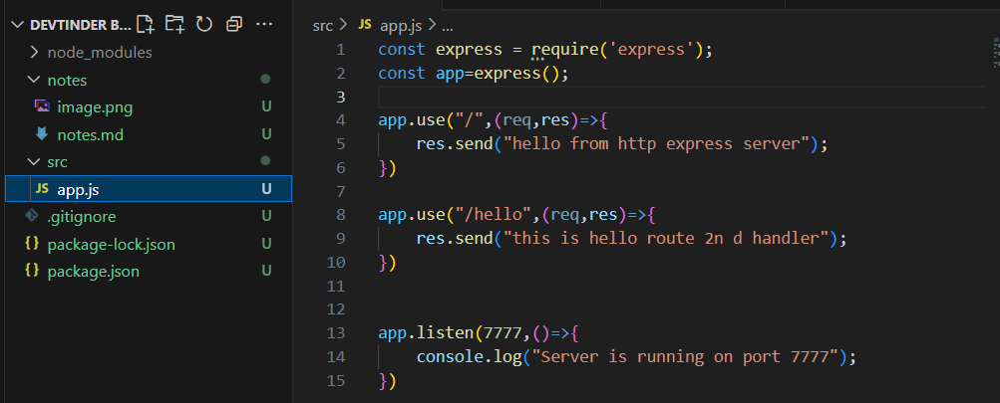
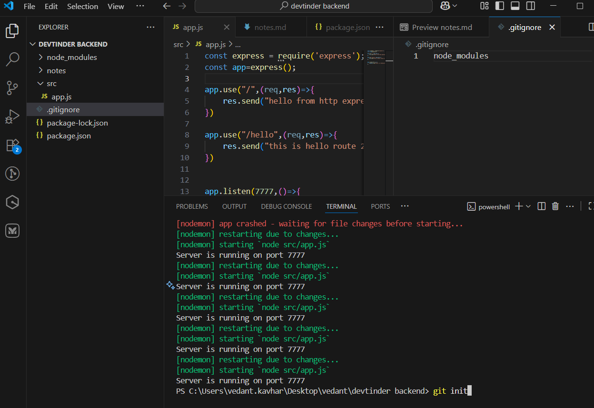
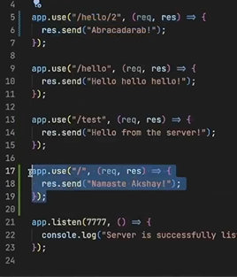
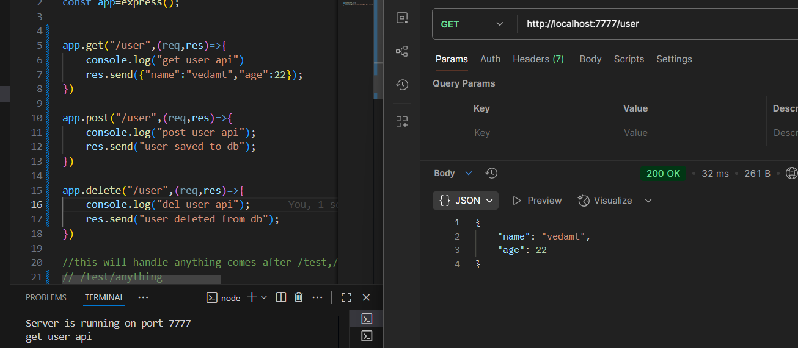
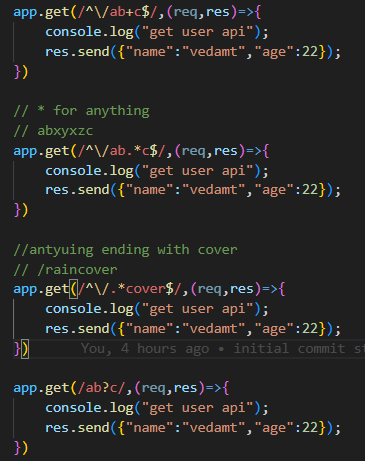
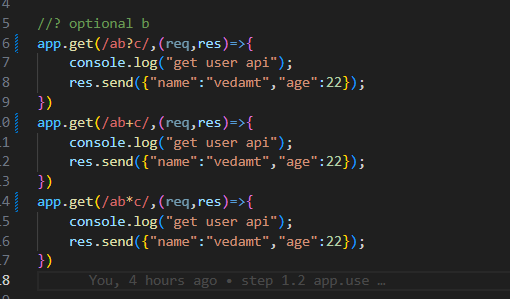
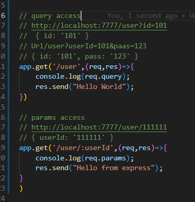
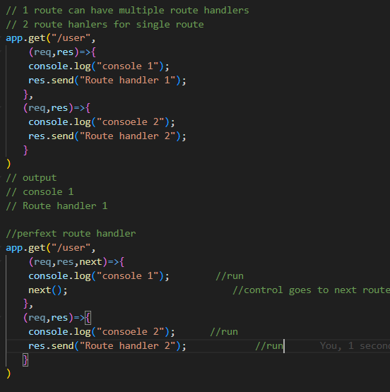
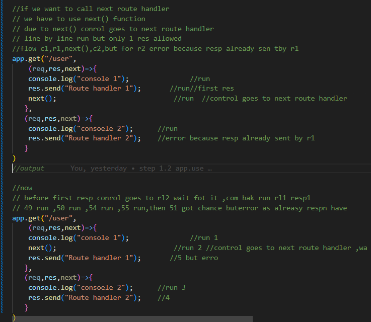
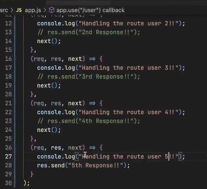

- e3 express setup
- 
- git setup
- 
- app.use

- httmp methods
-
- routing +,?,*

-     4
- both above works
- req.query ,req.params

- e5 middlwares error handlers
-   playing with route hanlers ,next () fun for moving to next rl
- 
- 
-