- e3 express setup
- 
- git setup
- 
- app.use

- httmp methods
-
- routing +,?,*

-     4
- both above works
- req.query ,req.params

- e5 middlwares error handlers onnlu img rem in onenote
-   playing with route hanlers ,next () fun for moving to next rl
- 
- 
-
- wrap in array also same work 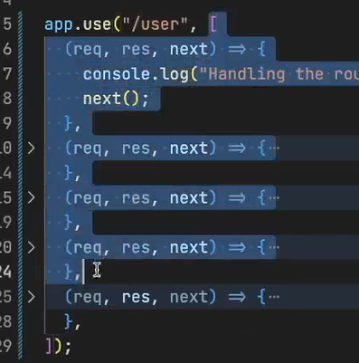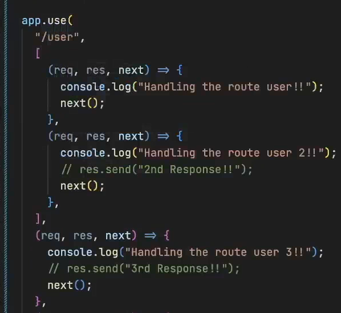
- same work ,diff syntax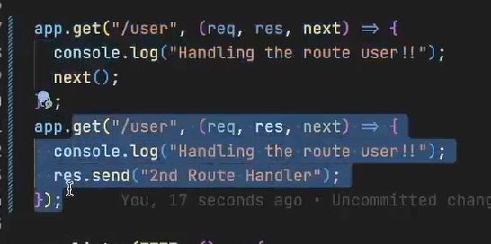
- midllware 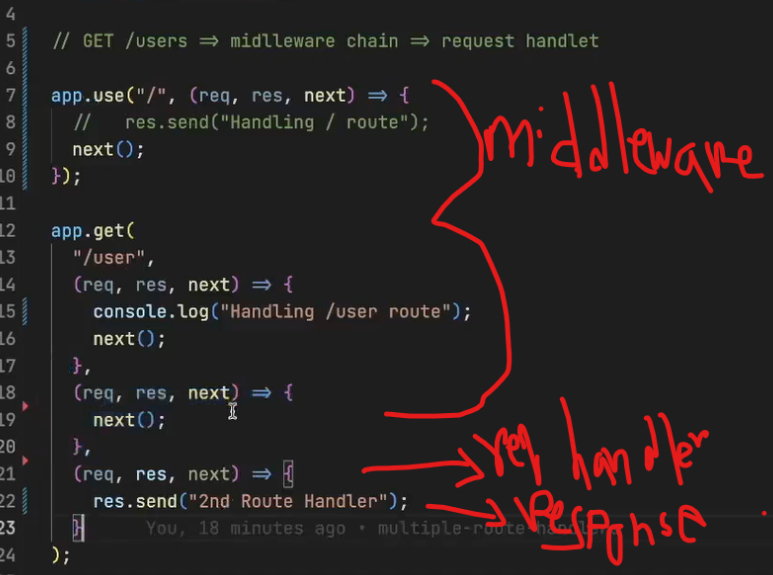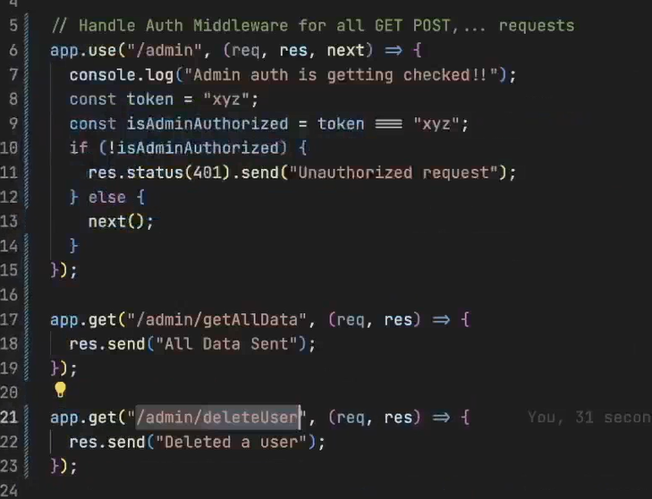
- 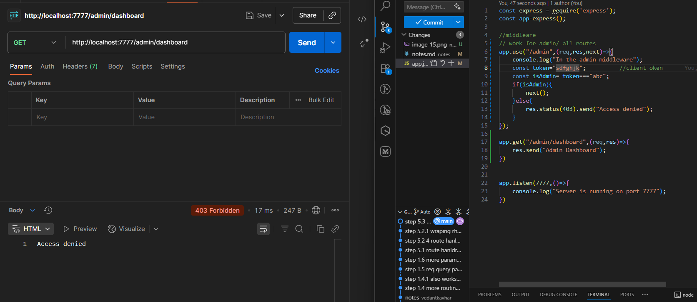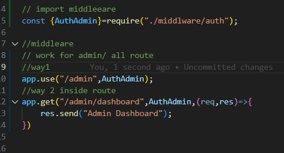
- error handling

- e6 connecting to db ,mongodb,cluster,schema,model,collection
- perfect connection 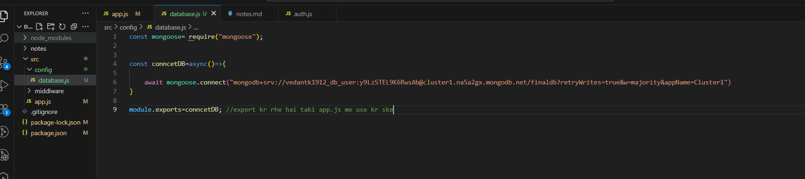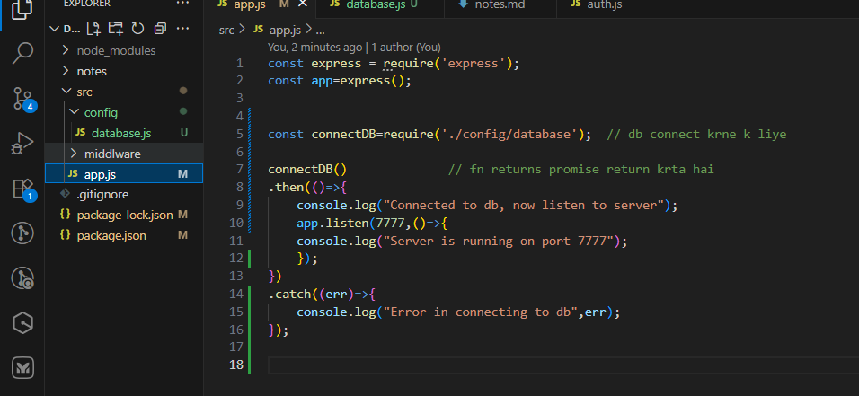
- model and schema 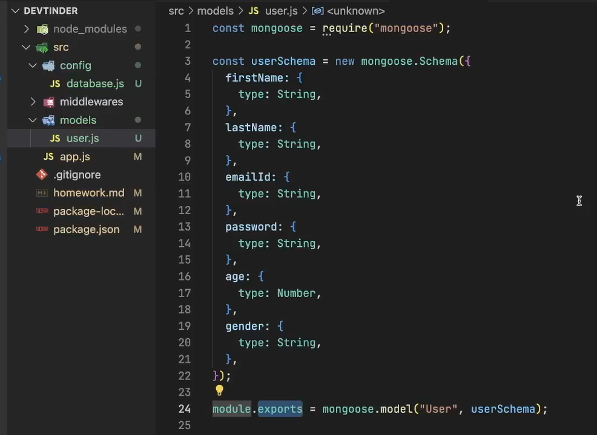
- saving hard coded manually data to users colletion/model inside db 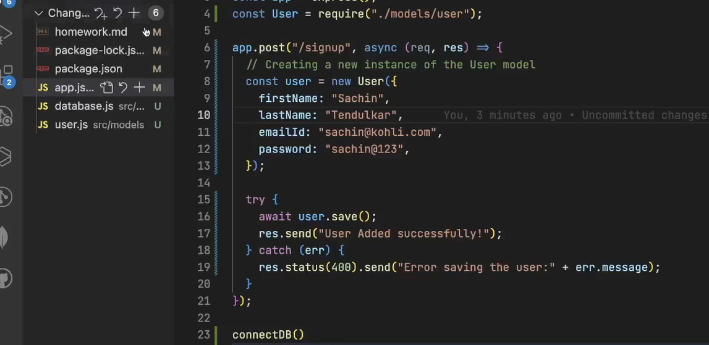 

- e7 apis detail
- psotman req.body ,express.json midlleware ,savinf to db 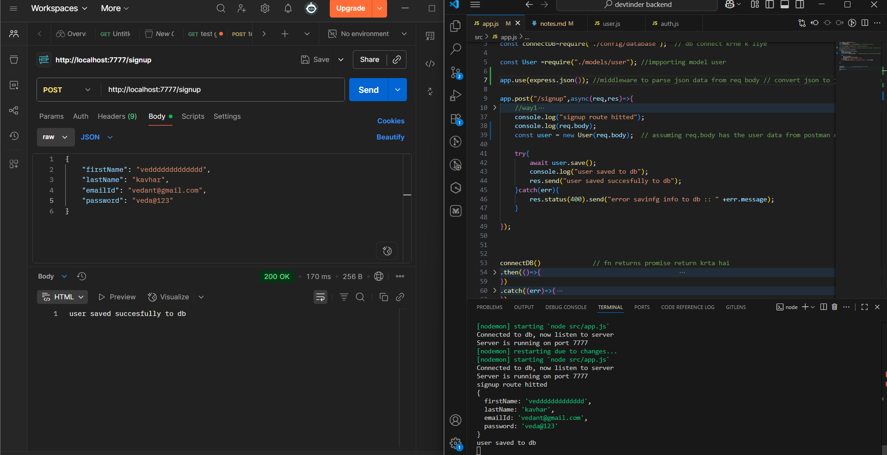
- 